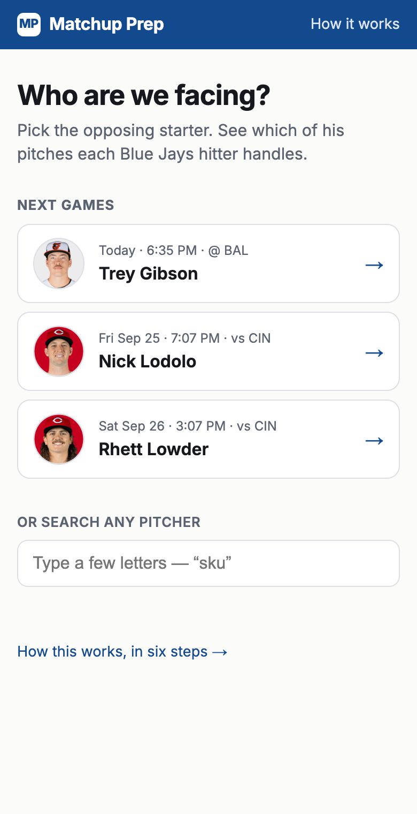
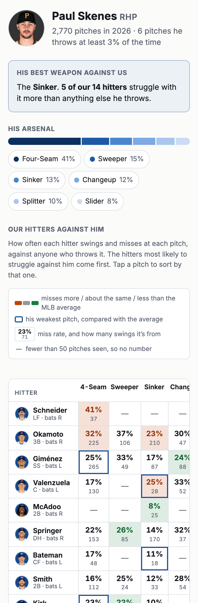
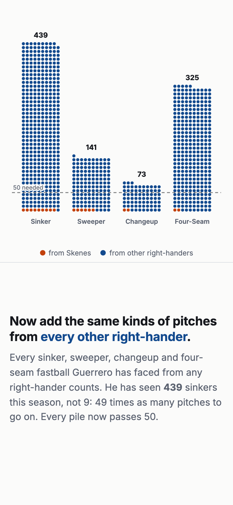

# Matchup Prep

**Pick the opposing starting pitcher and see which of his pitches each Blue Jays hitter handles, and which he doesn't.**

A phone-first web app for a hitting coach preparing for a game, built on every pitch of the 2026 MLB season (696,100 of them, from Statcast).

**Try it live: [matchup-prep.vercel.app](https://matchup-prep.vercel.app)** · [How it works](https://matchup-prep.vercel.app/how-it-works)

<table>
  <tr>
    <td width="33%"></td>
    <td width="33%"></td>
    <td width="33%"></td>
  </tr>
  <tr>
    <td align="center"><sub>The next opposing starters, one tap away</sub></td>
    <td align="center"><sub>The whole lineup against his arsenal</sub></td>
    <td align="center"><sub>The idea, explained with the pitches themselves</sub></td>
  </tr>
</table>

## The idea

A hitter almost never sees enough of one pitcher to learn anything. Vladimir Guerrero Jr. saw **19 pitches** from Paul Skenes all season. The most swings any hitter took against any one pitcher was **34**.

But he sees the same *kinds* of pitches all season long. So the app ignores who threw a pitch and groups every pitch by two things: **the hand that threw it** and **the kind of pitch** (a righty's sinker, a lefty's slider). That gives 16 groups covering 98.6% of all pitches, and the numbers get big:

| Guerrero vs a righty's… | from Skenes | from every right-hander |
|---|---:|---:|
| sinker | 9 | 439 |
| sweeper | 6 | 141 |
| changeup | 2 | 73 |
| four-seam fastball | 2 | 325 |

The matchup page crosses a starter's pitches with each Jays hitter's record against those kinds of pitches, from anyone. Every number is a miss rate (how often he swings and misses), coloured against the MLB average and shown with the number of swings behind it.

## What's in the app

- **Home page:** the Jays' next games with the opposing probable starters, from MLB's public schedule. In the offseason it falls back to the last games played, so it's never empty. Or search any pitcher.
- **The matchup grid:** hitters down the side, his pitches across the top. It opens with the hitters he's most likely to trouble. Tap a pitch to sort by who misses it most. Each hitter's weakest pitch is outlined, and the starter's "best weapon against us" is called out at the top.
- **Honest gaps:** a hitter needs 50 pitches of a kind before he gets a number; below that the cell stays blank. Pitch types too rare to measure are named rather than hidden.
- **How it works:** the idea as a scrolling picture, one dot per pitch, plus a plain-language "Why 50?".

## Does it hold up?

Measured with a split-half test (`make reliability`): every pitch goes into one of two random halves, and every number is computed twice from pitches that never overlap.

- **The numbers repeat.** A hitter's miss rate on a pitch group in one half predicts the other half at r = 0.70, so a full season's number is reliable to about **0.83**. The same test on hitter-versus-pitcher **can't even run**: no pair has the 50 swings it needs.
- **It isn't just "good hitters are good".** After removing each hitter's overall miss rate and how hard each pitch is for everyone, what's left, a hitter's trouble with a *specific* pitch, still repeats at **0.48**. That's real but not overwhelming, roughly half signal and half noise, which is why every number in the app shows its sample size.
- **Hand + pitch type is the right level of detail.** It captures more real difference between hitters (5.0 points of miss rate) than coarser groupings (4.5). Adding pitch speed (4.9) splits samples thinner without finding anything new.

## How it's built

```
Statcast (pybaseball)  →  Python pipeline  →  Postgres (Neon)  →  Next.js
 696,100 pitches           group every pitch     pre-built stats      server-rendered,
 as parquet                into hand + type,     tables: a page       phone-first
                           build the stats,      never scans the
                           cross-check them      pitch table
```

- **`ingest/`**: Python 3.12. Downloads Statcast, loads it, assigns every pitch to a group, and builds the stats tables. The aggregates are checked against a second, separately written implementation (`make verify`).
- **`db/`**: SQL migrations, and the grouping rule as a JSON file (`db/shapes/`).
- **`web/`**: Next.js 16 and React 19, TypeScript. The rules that decide what a coach sees (the 50-pitch floor, the arsenal floor, the colour thresholds) live in `web/lib/` as pure functions with unit tests, apart from the components.
- **`web/data/`**: the numbers on How it works, frozen by scripts (`make explainer`, `make reliability`), never typed into the page.

---

Not affiliated with or endorsed by MLB or the Blue Jays. Data: MLB Statcast via [pybaseball](https://github.com/jldbc/pybaseball), and the MLB Stats API.
